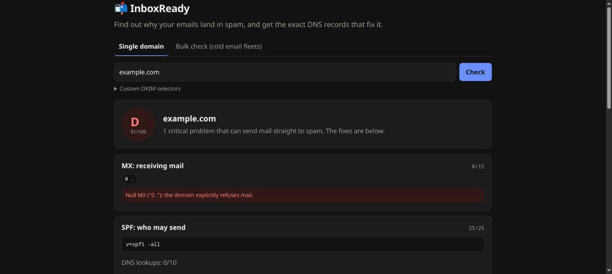
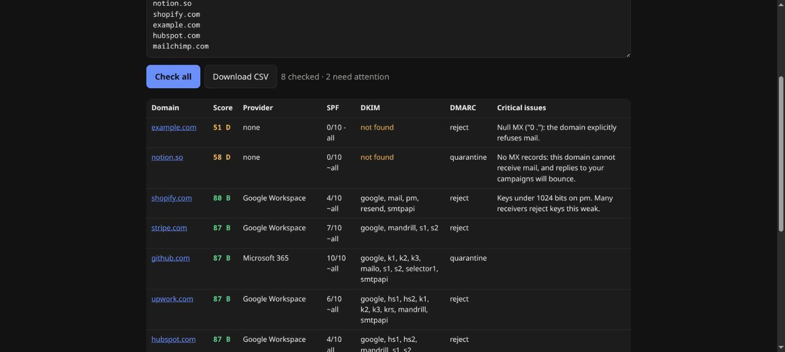

# 📬 InboxReady

[](https://github.com/prithveerarya345/inboxready/actions/workflows/ci.yml)
[](LICENSE)

**A free SPF, DKIM and DMARC checker for cold-email senders. Check one domain or 300 at once, and get the exact DNS records that fix what's broken.**

**Live:** https://prithveerarya345.github.io/inboxready/



## Why

Since February 2024, Gmail and Yahoo reject or spam-folder bulk mail that isn't properly authenticated. Outbound teams typically run 10–100 sending domains, and one broken record (a second SPF record, an SPF include chain over 10 lookups, a missing DMARC) quietly tanks a whole campaign. Most checkers test one domain at a time and stop at "fail". InboxReady checks a whole fleet and tells you what to paste into DNS.

## What it checks

| Check | Details |
|---|---|
| **MX** | Can the domain receive replies? Detects Google Workspace, Microsoft 365, Zoho, Proton, Fastmail, GoDaddy and more. Flags null MX. |
| **SPF** | Exactly one record; DNS lookups counted **recursively** across `include`/`redirect` against the RFC 7208 limit of 10; loop detection; `+all`/`?all`/missing `all`; deprecated `ptr`; whether your MX provider's include is present anywhere in the chain. |
| **DKIM** | Probes 34 common selectors (Google, Microsoft, SendGrid, Mailchimp/Mandrill, Zoho, Proton, Fastmail, Amazon SES, HubSpot, Resend…) plus any custom ones. Estimates RSA key size from the public key, flags weak (<1024) and legacy (1024) keys, and detects revoked and **wildcard** `*._domainkey` records so they aren't reported as real keys. |
| **DMARC** | Policy, `pct`, `rua`, multiple records, and inheritance from the organizational domain (`sp=`), checked against the 2024 bulk-sender rules. |
| **Extras** | MTA-STS, TLS-RPT, BIMI. |

Every failing section comes with a **suggested record** (for example `v=spf1 include:_spf.google.com ~all`, chosen from the detected mail provider) and a copy button.

## Bulk mode

Paste up to 300 domains or email addresses, sort by score, and export a CSV. You can also share a run as a link: `?bulk=domain1.com,domain2.com`.



## How it works

- **No backend.** All lookups go from your browser to Cloudflare's DNS-over-HTTPS JSON API (`cloudflare-dns.com/dns-query`). Nothing is logged or stored.
- `checks.js` is pure logic with the resolver injected, so the whole engine is unit-tested offline against fake DNS zones (`test/checks.test.mjs`, run with `node --test test/checks.test.mjs`).
- Lookups are cached per run and DKIM selectors are probed in parallel. Bulk mode runs 4 domains at a time.
- Plain HTML, CSS and ES modules. No build step, no dependencies, hosted on GitHub Pages.

```
checks.js          DNS + parsing + scoring (pure, testable)
app.js             UI: single report, bulk table, CSV export, deep links
test/              18 unit tests (SPF recursion/limits/loops, DMARC inheritance, DKIM key size + wildcard, scoring)
```

## Run locally

```bash
python3 -m http.server 8000   # then open http://localhost:8000
node --test test/checks.test.mjs   # run the tests
```

## Scoring

MX 15 · SPF 25 · DKIM 25 · DMARC 25 · Extras 10, normalized to 100. A ≥ 90, B ≥ 75, C ≥ 60, D ≥ 40.

## Limitations

- Blacklist (DNSBL) checks are not included, because the major lists block queries from public resolvers.
- DKIM can only be found when the selector is guessable. Add yours under *Custom DKIM selectors*.
- Key size is estimated from the encoded public key length, not by parsing ASN.1.

---

Built by [Prithveer Arya](https://www.upwork.com/freelancers/~019d6b13ad7d398778). I set up and fix outbound email infrastructure, n8n/Apps Script automations and AI agents. Hire me on Upwork.
